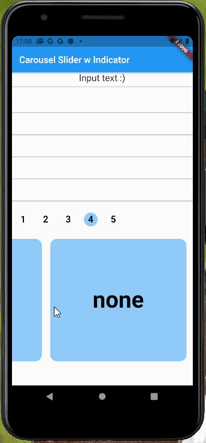

# Carousel Slider with Indicator

For carousel slider
 - https://pub.dev/packages/carousel_slider/versions/4.0.0-nullsafety.0

For state management of Indicator
 - https://pub.dev/packages/flutter_hooks/versions/0.16.0-nullsafety.0

For state management of Carousel Items
 - https://pub.dev/packages/hooks_riverpod/versions/0.13.0-nullsafety.3

## like this

