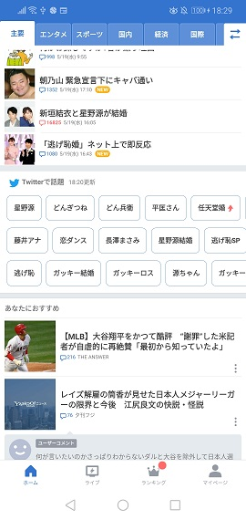
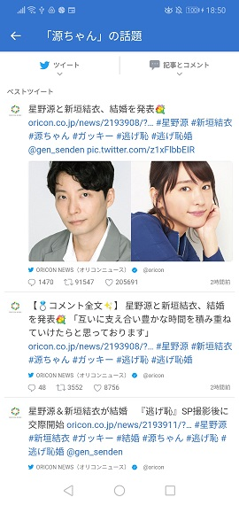

# Fetch Twitter Trends thru Twitter API then display Twitter screen on Web-View

アプリでTwitterトレンドが出てきて、タップするとウェブビュー画面に遷移する、みたいなロジック、よく見ますよね？

あれをやりたいなと思います。こんな感じで。下記の例はyahooニュースアプリです。1,2枚目のスクショはAPI叩いてとったデータをクライアント側で整形しているかんじですよね。3枚目のスクショがwebviewで表示しているものですね。

...... ところで、

みんなのガッキーがお嫁に行きましたね ;)

おめでとう！ガッキー!!!!!!!

