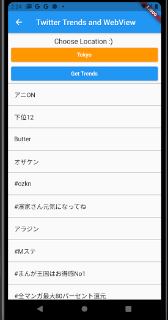
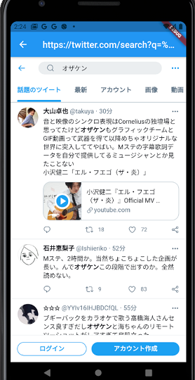

# Twitter API brah

Twitter API docs -> https://developer.twitter.com/en/docs/twitter-api
## Recent Search

- GET /2/tweets/search/recent
  - https://developer.twitter.com/en/docs/twitter-api/tweets/search/api-reference/get-tweets-search-recent
- cached_network_image
  - https://pub.dev/packages/cached_network_image

アプリでTwitterトレンドが出てきて、タップするとウェブビュー画面に遷移する、みたいなロジック、よく見ますよね？

あれをやりたいなと思います。こんな感じで。下記の例はyahooニュースアプリです。

- バックエンドでAPI叩いてデータをフロント用に整形 
- -> DB保存 
- -> リクエストを受け取りフロントに流す
- -> 時間経過トリガーとかでバックエンド側でTwitterデータ再取得
- -> ...

という流れだと思うのですが、今回はフロントでAPI叩いて整形しています。3枚目のスクショがwebviewで表示しているものですね。

...... ところで、

みんなのガッキーがお嫁に行きましたね ;)

おめでとう！ガッキー!!!!!!!

いろいろいじったところ、ざっくり下記のようになりました。

## Twitter Trends by Location and Webview

- GET trends/place
  - https://developer.twitter.com/en/docs/twitter-api/v1/trends/trends-for-location/api-reference/get-trends-place
- flutter_web_view 
   -  https://pub.dev/packages/webview_flutter

地域を選択して、トレンドを取得、タップするとそのトレンド検索の画面(webview)に移行します。

Recent Searchのほうはこんなかんじで、地域選択して

